# 记一次从代码审计到webshell到提权尝试的完整渗透过程 #

## 代码审计 ##

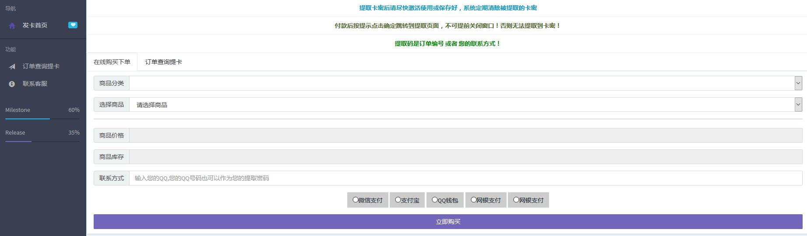
如图这次审计做的是某发卡cms，整体就是一个用户购买卡并提取卡密的平台。
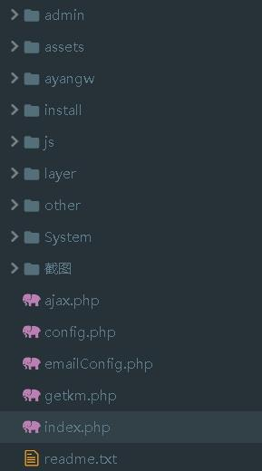
如图，结构比较简单。

其中config.php为mysql配置文件，其中会有mysql配置信息，下文会再提到。

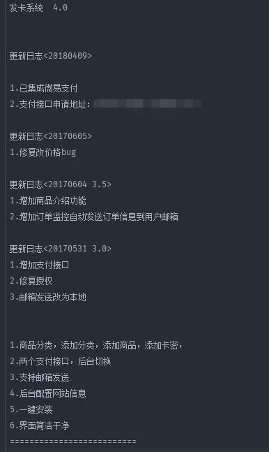
从readme里面可以看到，此CMS在18年4月还进行了更新。但此CMS安全水平非常差，可以说是漏洞百出。下面进行分析

### sql漏洞 ###

进入`getkm.php`，这是一个提取卡密的页面，提供了查询卡密的接口。部分sql关键代码如下
```php
	<?php }elseif ($_GET['act'] == "query") { 
	/**/
	if(!empty($_POST['tqm'])){
    $tqm = $_POST['tqm'];
    $sql = "select * from ayangw_km
    where out_trade_no ='{$tqm}' or trade_no = '{$tqm}' or rel = '{$tqm}'
    ORDER BY endTime desc
    limit 1";
    
    $res = $DB->query($sql);
    if($row = $DB->fetch($res)){
        $sql2 = "select * from ayangw_goods where id =".$row['gid'];
        $res2 = $DB->query($sql2);
        $row2 =$DB->fetch($res2);
    }else{
        exit("<script>alert('无此条记录！');window.location.href='getkm.php'</script>");
        
    }
}
	    ?>
```

可以看到典型的sql直接拼接造成的sql漏洞，`$tqm`参数直接传入用户输入也未做过滤。我回溯了`$DB`函数，也未发现安全过滤措施，所以sqlmap直接可以撸下来。

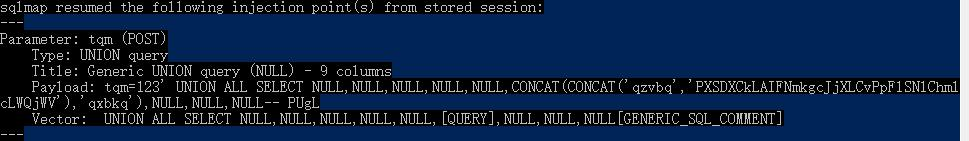

其他地方的sql查询也差不多，漏洞百出，就此跳过sql注入。

### 后台上传漏洞 ###

来到后台在`set.php`，上传logo的代码部分如下：
```php
if($_GET['mod']=='upimg'){
echo '<div class="panel panel-primary"><div class="panel-heading"><h3 class="panel-title">更改首页LOGO</h3> </div><div class="panel-body">';
if($_POST['s']==1){
$extension=explode('.',$_FILES['file']['name']);
if (($length = count($extension)) > 1) {
$ext = strtolower($extension[$length - 1]);
}
if($ext=='png'||$ext=='gif'||$ext=='jpg'||$ext=='jpeg'||$ext=='bmp')$ext='png';
copy($_FILES['file']['tmp_name'], ROOT.'/assets/imgs/logo.'.$ext);
echo "成功上传文件!<br>（可能需要清空浏览器缓存才能看到效果）";
}
```
可以看到作者的思路就是分割开文件名跟文件后缀，然后对后缀进行小写处理，再进行对比，如果是作者白名单里的图片格式就统一改成`png`格式。

但是让人哭笑不得的是作者只写了白名单的处理，`if`之后居然没写`else`。。。而且白名单的比较也是弱类型的比较，并且没有对截断符号等进行过滤。

简化了一下写了一个demo示意了一下上传过程，可以看到我们的上传的文件将会直接变成`/assets/imgs/logo.php`
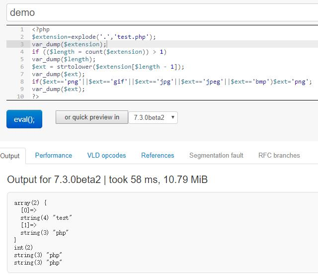

所以我们可以这样上传拿到webshell。

## webshell ##

googlehack了一下，用这个卡密CMS的网站还不少。

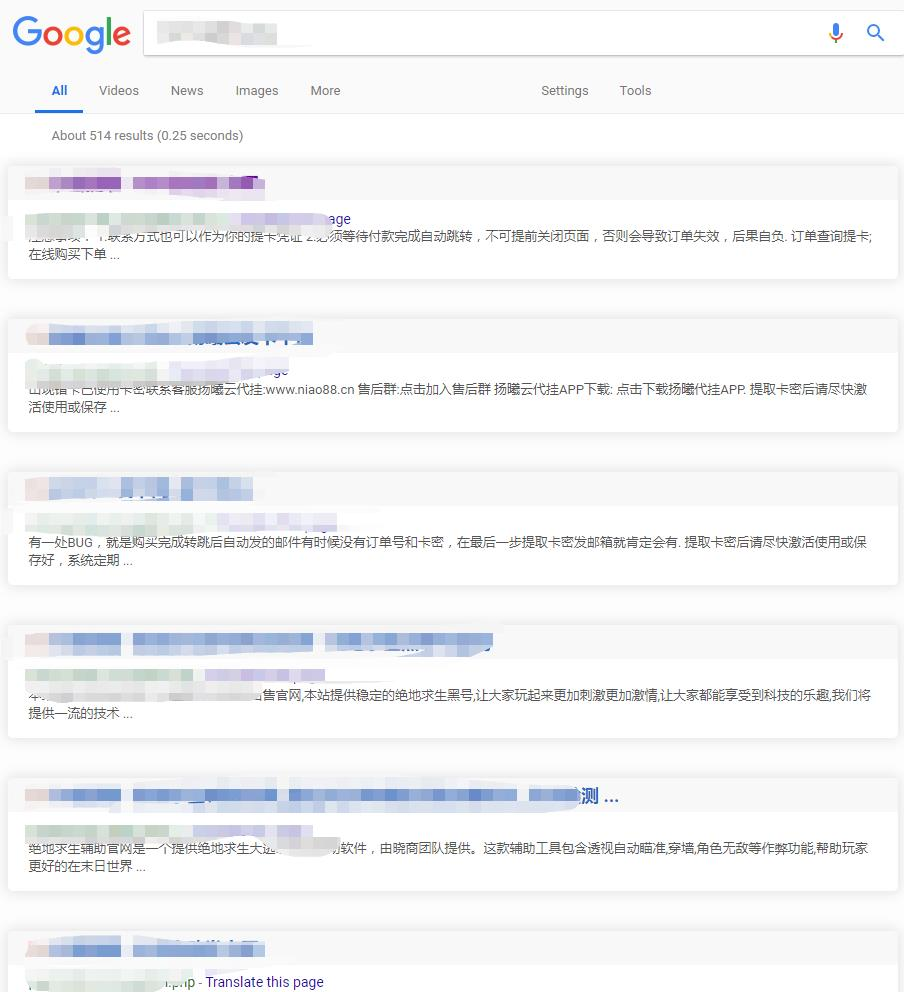

顺便一说，在git也发现了跟这个发卡系统非常象的一个CMS，大概上区别不大，也不知道是谁抄谁的。

随便找了一个想拿个webshell试试，基本就是按照审计发现的思路，`sqlmap`爆了`admin`然后进后台传`webshell`。

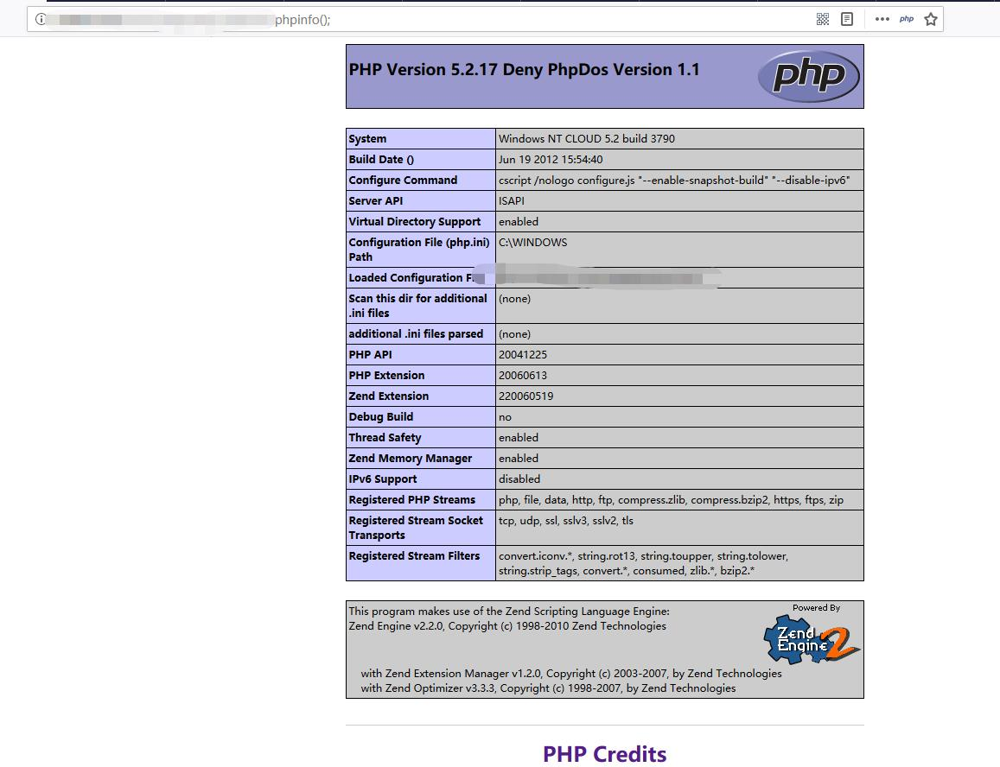

## 尝试提权失败，记一下思路 ##

从**phpinfo**中可以看到系统为windows NT CLOUD 5.2 2003，php版本为5.2,此版本暂时不知道如何绕过**disablefunction**。
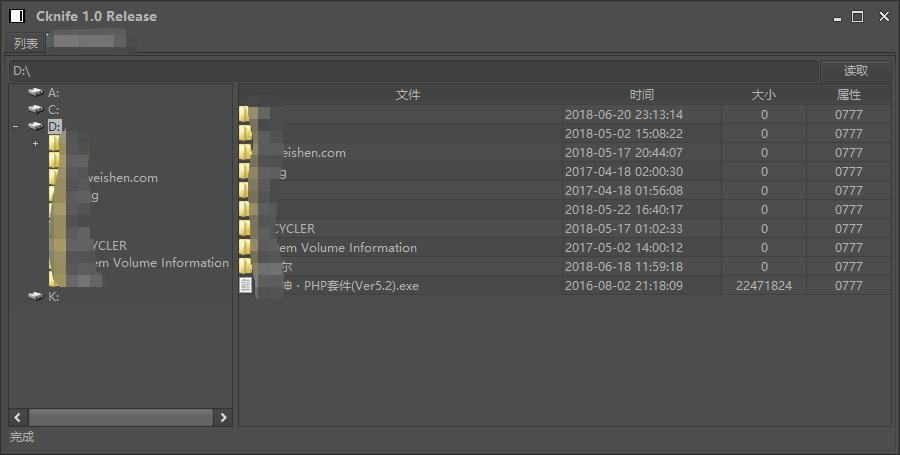
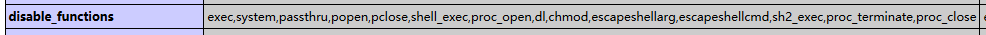
可以看到只有D盘的读写权限，php命令执行权限也全部禁掉了，放弃利用php提权。

nmap扫一下看看
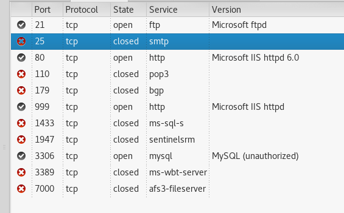

 可以看到有**3306**的mysql端口，尝试连接有IP限制。**999**端口则是**phpmyadmin**，之前在上文提到的`config.php`配置文件中可以get到数据库的**root**，于是进去**phpmyadmin**，尝试UDF,MOF提权，均无果。

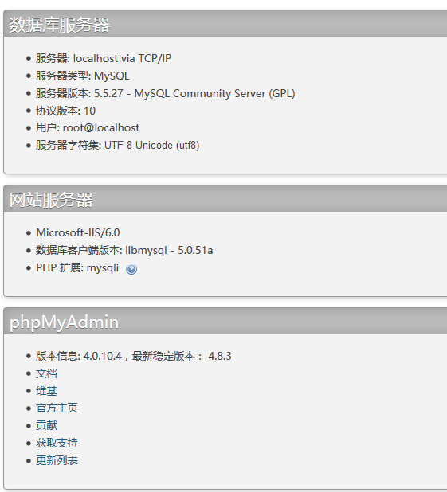

 有大佬提醒了一下`IIS`可以试试asp，aspx是否可以提权，测试aspx无法执行，但asp可以。上传asp测试后，组件也都不可用。。。提权无果
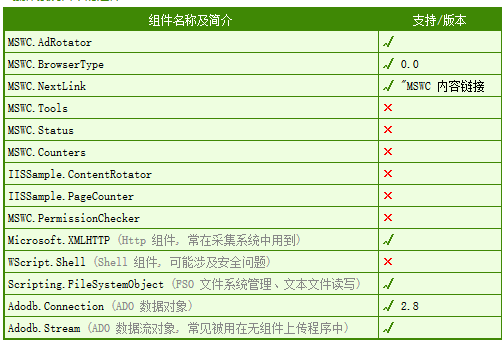

 新手一枚请多担待！